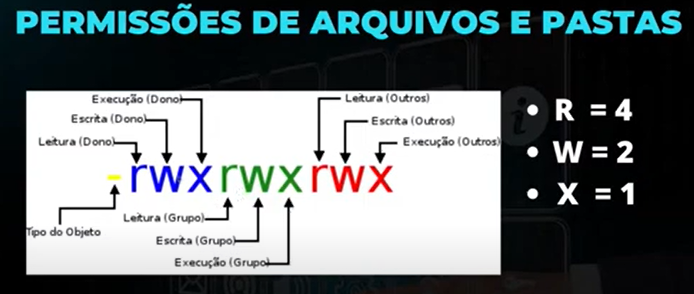
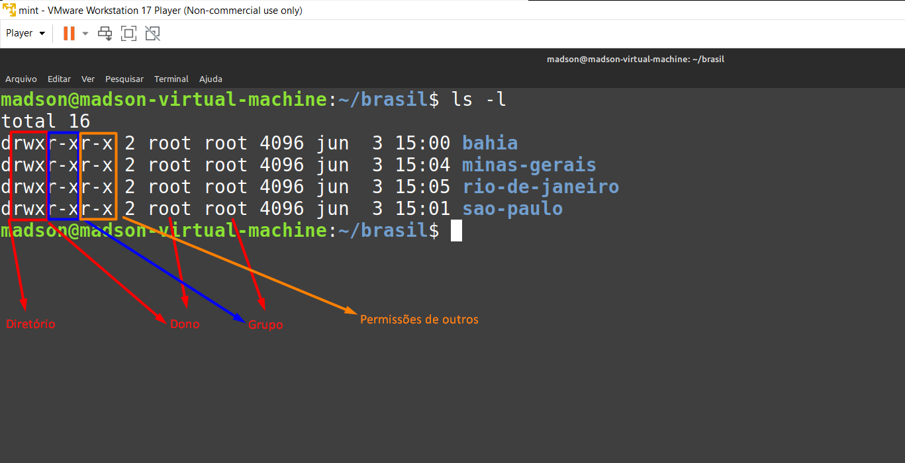

## Permissões



- Permissão de dono: quem criou;

- Permissão de grupo: usuários do grupo;

- Permissão de outros: quem não criou e pode ou não está no grupo;

- obs.: r -> read | w -> write | x -> execute


#### Exercitando

- O comando ` ls -l ` mostra os arquivos da pasta e com as permissões;




#### Modificando permissões:

- O comando ` chmod ` é usado para modificar as permissões;

- Exercitando: deixar as seguintes permissões no diretório ` bahia `: rw- rwx r-x

```
cd ~

cd brasil

ls -l -> drwxrwxr-x

chmod 675 bahia/

ls -l -> drw-rwxr-x
```

- No geral, fazendo as somas, de r=4, w=2 e x=1, podemos dar as permissões necessárias para dono, grupo e outros;