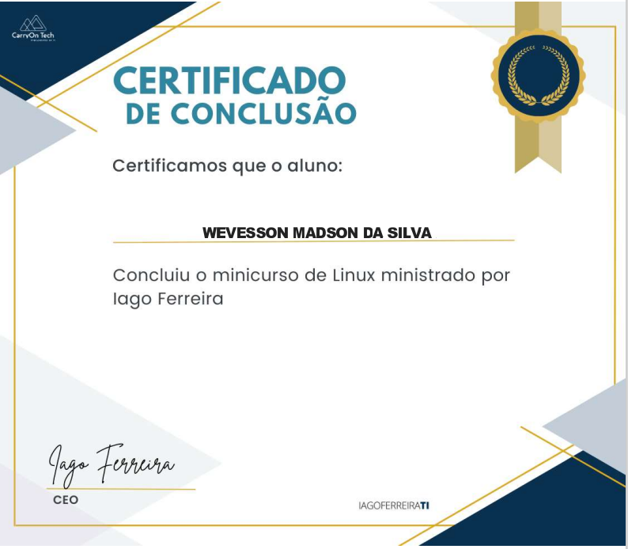

## Curso de linux

```
Repositório do curso de linux DEVOPS.
```

- Estrutura de pastas;
- Comandos essenciais;
- Permissões de arquivos e pastas;
- Monitoramento do sistema operacional (CPU, MEMORIA, DISCO E REDE);
- Analise de logs nas aplicações;
- Gerenciamento de processos;
- Criação de scripts;
- Instalação de pacotes;
- Gerenciamento de serviços;
- Verificação de logs;

### Arquivos de aulas:

[Estrutura de diretórios](./Diretorios.md)

[Comandos essenciais](./Comandos_Essenciais.md)

[Gerenciamento de pastas e arquivos](./Gerenciando_pastas_e_arqivos.md)

[Instalação de pacotes](./Instalando_Pacotes.md)

[Visualização de logs](./Vizualizando_logs.md)

[Gerenciamento de Permissões](./Permissões.md)

[Usuários linux](./Usuarios.md)

[Gerenciamento de discos](./Discos.md)

[Criação de Scripts](./Scripts.md)

<br><br>

[Certificado:](./assets/certificado.pdf)


